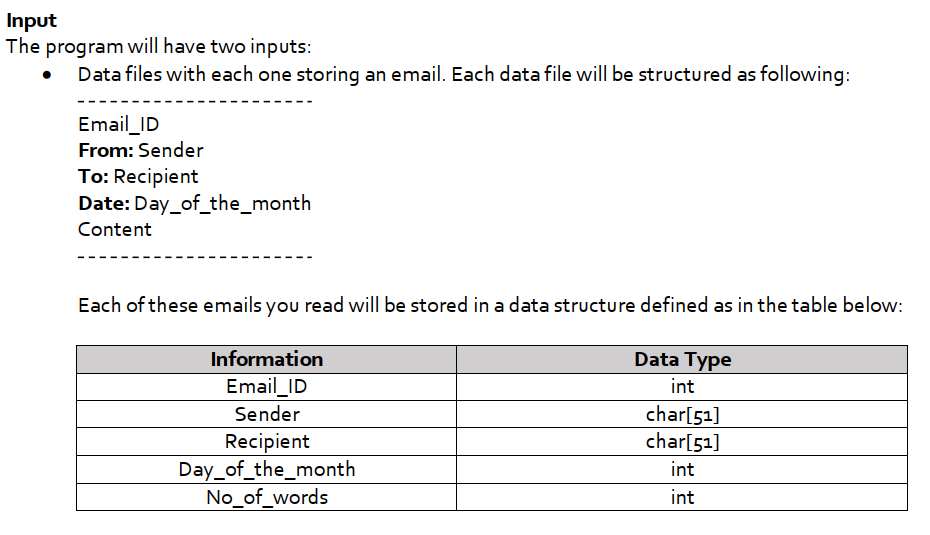
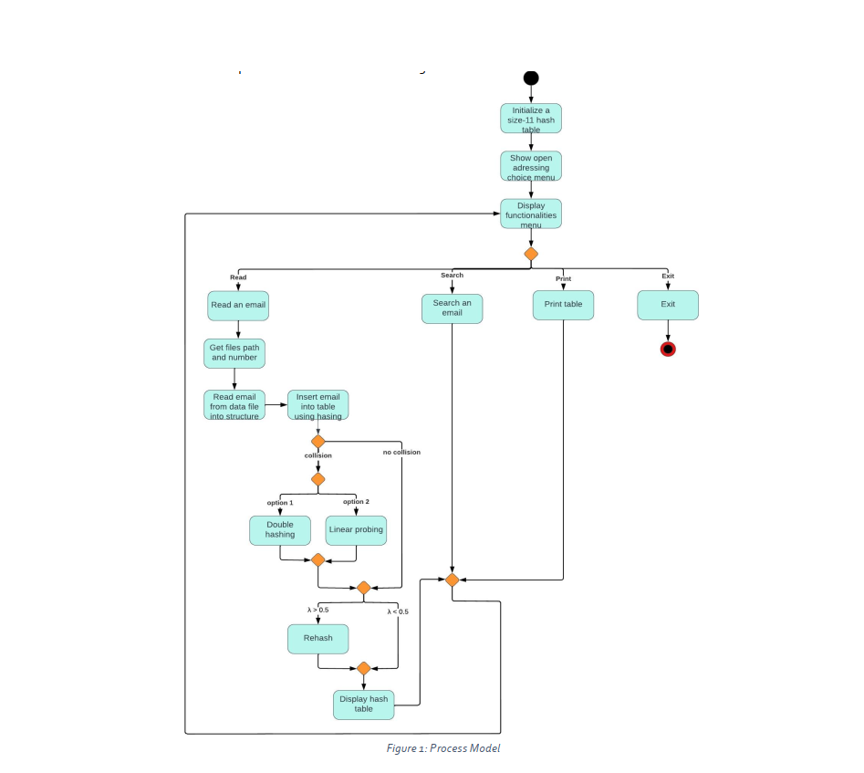

# HashTables

This was an assignment which aims to help you practice the hash tables, especially collision resolution with open addressing. The main task in this assignment is to develop a hash table to store some emails.

This program is able to:

-read all the emails in a specified folder

-search for an email by its ID and sender's name

-print out the hash table.

 ### Input ###

 ### Hashing ###
The application shall create a hash table in which the user decides what open addressing technique
to be used:

- If the user enters 1, then the table will use double hashing (where f(i) = i * hash2(key)),

- But if they enter 2, then linear probing (where f(i) = i) will be used.

The initial size of the hash table should be 11. If the load factor λ (the total number of emails in a hash
table / the size of the hash table) becomes larger than 0.5, then rehashing should be applied with the
following steps:

1. Compute the size of the new hash table by multiplying the size of the old hash table by two
and then rounding it to the next prime number

2. Dynamically allocate a new hash table and locate the emails into the new hash table properly

3. Destroy the old hash table
The following hash functions to be used:

- key = Email_ID + ASCII (sender[0]) - 65

- hash(key) = (key) mod hashTableSize

- hash2(key) = 5 – (key mod 5)

 ### Process Model ###
 
 